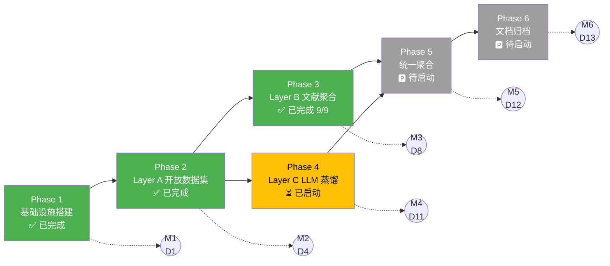

# Health_man 项目技术路线图

<!-- UPDATE_MARKER: doc_header -->
| 项 | 值 |
|---|---|
| 文档版本 | v1.2 |
| 最后更新 | 2026-07-12 |
| 文档状态 | 活跃维护 |
| 适用范围 | MVP1.0 外部医学数据获取子系统 |
| 关联文档 | [PROJECT_STATUS.md](./PROJECT_STATUS.md)、[FORWARD_PLAN.md](./FORWARD_PLAN.md)、[Spec v1.1](../specs/2026-07-12-data-acquisition-strategy-design.md) |

---

## 一、项目愿景

Health_man 是一个自研硬件-软件一体化的桌面人体健康检测平台（MVP1.0），采用 **BIA 双脚四电极体脂模组 + PPG 指端血氧模组** 双模组架构，单机 Windows + Python 运行，30 秒内完成测量并输出 35 项健康指标 + 中医体质参考，最终交付对标样例报告的"全息健康评估"形态。当前阶段聚焦于"外部医学数据获取子系统"的建设，通过三层分工架构（Layer A 开放数据集直采 + Layer B 文献聚合 + Layer C LLM 蒸馏增强）补齐 V2 审计识别的 33 项 IND 指标参考范围对标数据，严格遵循 0 成本、个人开发者可执行、全程合规可审计的约束。

---

## 二、技术栈概览

### 2.1 语言与运行环境

| 维度 | 选型 | 版本要求 |
|---|---|---|
| 编程语言 | Python | 3.11+ |
| 操作系统 | Windows 11 | - |
| Shell | PowerShell 5 | - |
| 工作目录 | `e:\Health_man` | - |

### 2.2 核心依赖库

| 类别 | 库 | 用途 |
|---|---|---|
| 数据处理 | pandas | DataFrame 操作 |
| 列式存储 | pyarrow | Parquet 读写 |
| SAS 数据 | pyreadstat | XPT 文件读取 |
| PDF 处理 | PyMuPDF (fitz) | PDF 表格提取 |
| 网络请求 | requests / aiohttp | HTTP 下载 |
| 配置管理 | PyYAML | YAML 配置文件 |
| 安全加密 | cryptography | AES-256-GCM |
| 凭证管理 | keyring | OS 密钥链集成 |
| 任务调度 | APScheduler | 增量更新检查 |
| 机器学习 | scikit-learn | KNN 填充、孤立森林 |
| 测试框架 | pytest + pytest-cov + pytest-asyncio | TDD 强制 |

### 2.3 存储与格式标准

| 数据类型 | 强制格式 | 说明 |
|---|---|---|
| 表格数据 | Parquet + Snappy | 列式存储、压缩比高、带 schema |
| 嵌套结构 | JSON (UTF-8) | 通用、可读 |
| 文本语料 | UTF-8 文本 | 可直接被 LLM 处理 |
| 二进制波形 | WFDB 或 EDF | 医学标准格式 |
| 文档 | Markdown | 版本控制友好 |

### 2.4 三层分工架构

```
┌─────────────────────────────────────────────────────────────────────┐
│                    统一数据存储目的地                                  │
│         e:\Health_man\data\knowledge\chinese_reference\               │
│         (结构化存储目录: 7 个子目录, 单域 ≤1GB, 总量 ≤8GB)            │
└────────────────────────────┬────────────────────────────────────────┘
                            │
              ┌─────────────┴─────────────┐
              │   数据治理中台（Data Governance Hub）   │
              │   - 命名规范 / 格式标准 / 元数据描述     │
              │   - 去重 / 清洗 / 标准化 / 异常值处理    │
              │   - 数据字典 / 字段说明 / 处理流程文档   │
              │   - 冗余控制 / 可扩展 Schema             │
              └─────────────┬─────────────┘
                            │
        ┌───────────────────┼───────────────────┐
        │                   │                   │
┌───────▼──────┐    ┌───────▼──────┐    ┌───────▼──────┐
│  Layer A     │    │  Layer B     │    │  Layer C     │
│  开放数据集   │    │  文献聚合     │    │  LLM 蒸馏    │
│  直采        │    │              │    │  (国内优先)   │
└──────────────┘    └──────────────┘    └──────────────┘
   ~25 项指标       ~8 项独家      ~3-5 项增强
   完全免费         完全免费         ¥0（免费额度内）
```

---

## 三、六阶段全景路线图

<!-- UPDATE_MARKER: phase_roadmap_table -->
| 阶段 | 名称 | 目标 | 核心交付物 | 状态 | 工期 | 依赖 |
|---|---|---|---|---|---|---|
| Phase 1 | 基础设施搭建 | 建立存储目录体系、治理配置、统一 Schema、安全工具链 | 存储目录树、`_governance/config.yaml`、`indicator_mapping.json`、`quality_rules.yaml`、`roles.yaml`、加密/凭证/重试/限流/熔断/审计工具 | ✅ 已完成 | 1 天 (D1) | 无 |
| Phase 2 | Layer A 开放数据集直采 | 实现 NHANES 适配器全流程端到端验证，覆盖 25 项指标 | `SourceAdapter` 抽象基类、`NHANESAdapter`、`DownloadScheduler`、`FormatConverter`、`Preprocessor`、`QualityChecker`、`MetadataGenerator`、A_open_datasets/ 元数据 | ✅ 已完成 | 3 天 (D2-D4) | Phase 1 |
| Phase 3 | Layer B 文献聚合 | 实现 PubMed 检索、开放科学平台下载、PDF 表格提取、中医体质 9 型判定 | `PubMedAdapter`、`OpenScienceAdapter`、`PdfTableExtractor`、`GascPdfExtractor`、`TcmStandardLoader`、`TcmConstitutionClassifier`、`ExtractionLogManager`、`LiteratureMetadataGenerator`、`LayerBPipeline`、B_literature/ 数据 | ✅ 已完成（9/9 任务，READY FOR MERGE） | 4 天 (D5-D8) | Phase 1-2 |
| Phase 4 | Layer C LLM 蒸馏增强 | 国内大模型蒸馏补齐 3-5 项难提取指标 | `ModelAdapter`、API 网关、提示词模板库、`C_llm_distilled/` + 审计日志 | ⏳ 已确认启动（待编写 plan） | 3 天 (D9-D11) | Phase 1-3 |
| Phase 5 | 统一聚合与质量门禁 | 三层数据映射统一 indicator_id、去重、质量评分、生成 unified JSON | `chinese_reference_unified.json`、质量门禁报告、`unified/data_dictionary.md` | 🅿️ 待启动 | 1 天 (D12) | Phase 2-4 |
| Phase 6 | 数据字典与文档归档 | 编写完整数据字典、处理流程文档、归档快照 | `data_dictionary.md`、各数据集 `*_pipeline.md`、`_archive/snapshots/snapshot_2026-07-12/`、`changelog.md` | 🅿️ 待启动 | 1 天 (D13) | Phase 5 |

**总计工期：** 13 个工作日（约 3 周），Phase 4 已确认启动。

---

## 四、阶段依赖关系图



**依赖说明：**
- Phase 2 强依赖 Phase 1（复用治理配置与安全工具链）
- Phase 3 强依赖 Phase 1-2（复用 `SourceAdapter`、`DownloadScheduler`、`QualityChecker`、安全工具）
- Phase 4 依赖 Phase 1-3（复用安全工具链、凭证管理）
- Phase 5 依赖 Phase 2-4（聚合三层数据）
- Phase 6 依赖 Phase 5（基于 unified JSON 生成文档）

---

## 五、关键里程碑

<!-- UPDATE_MARKER: milestones_table -->
| 里程碑 | 阶段 | 日期 | 交付物 | 验收标准 | 状态 |
|---|---|---|---|---|---|
| **M1** | Phase 1 | D1 (2026-07-12) | 基础设施就绪 | 目录树 + 治理配置 + Schema + 安全工具全部完成；12 个模块单元测试通过 | ✅ 已达成 |
| **M2** | Phase 2 | D4 | Layer A 完成 | NHANES 适配器全流程验证通过；25 项指标参考范围 + 三层元数据；57 个测试通过 | ✅ 已达成 |
| **M3** | Phase 3 | D8 | Layer B 完成 | PubMed 检索 + PDF 表格提取 + 中医体质 9 型判定 + B_literature/ 数据 | ✅ 已达成（9/9 任务，122 测试，READY FOR MERGE） |
| **M4** | Phase 4 | D11 | Layer C 完成 | 3-5 项难提取指标 + LLM 审计日志 + 国内大模型适配器 | ⏳ 已启动（待编写 plan） |
| **M5** | Phase 5 | D12 | 统一聚合完成 | `chinese_reference_unified.json` 通过质量门禁（≥33 项指标覆盖） | 🅿️ 待启动 |
| **M6** | Phase 6 | D13 | 文档交付 | 数据字典 + 各数据集 pipeline 文档 + 归档快照 | 🅿️ 待启动 |

---

## 六、风险矩阵

<!-- UPDATE_MARKER: risk_matrix -->
基于 Spec §10 风险评估，结合 Phase 1-2 实施经验与 Phase 3 计划，识别 8 个关键风险：

| 风险 ID | 风险描述 | 类别 | 概率 | 影响 | 严重度 | 缓解措施 | 责任人 |
|---|---|---|---|---|---|---|---|
| **R1** | NHANES/KNHANES 服务器不稳定，下载失败 | 技术 | 中 | 中 | 🟠 | 重试 3 次 + 指数退避 + 断点续传 + 镜像源备选；已实现 `DownloadScheduler` + `retry_with_backoff` | 开发者 |
| **R2** | CNKI 全文 PDF 受版权限制无法下载 | 合规 | 高 | 中 | 🟠 | 仅用公开摘要 + 补充材料 + figshare 共享数据；`ExtractionLogManager` 记录状态 | 开发者 |
| **R3** | LLM 提取数据存在幻觉（Phase 4） | 质量 | 高 | 高 | 🔴 | 人工抽检 20% + 交叉验证 + 金标准对照；双层验证（结构化 + 语义）；`confidence < 0.5` 自动拒绝 | 开发者 |
| **R4** | GLM/Qwen 免费额度耗尽（Phase 4） | 成本 | 中 | 中 | 🟠 | 多模型轮询 + 月度配额监控；`TokenBucketLimiter` + `CircuitBreaker` 故障转移；GLM-4-Flash 完全免费兜底 | 开发者 |
| **R5** | 中医体质文献术语不规范 | 质量 | 高 | 中 | 🟠 | 以国标 ZYYXH/T157-2009 为准；`TcmStandardLoader` 数字化标准；`TcmConstitutionClassifier` 60 题量表判定 | 开发者 |
| **R6** | 数据集体量超限 | 运营 | 低 | 低 | 🟡 | `LayerBPipeline.audit_size()` 自动审计；单域 1GB / 总量 8GB 上限；Parquet+Snappy 压缩 | 开发者 |
| **R7** | 跨数据集指标定义不一致 | 质量 | 高 | 中 | 🟠 | 统一 `indicator_mapping.json` 映射；`Preprocessor` 字段标准化；`QualityChecker` 跨字段一致性校验 | 开发者 |
| **R8** | 国内大模型 API 协议变更（Phase 4） | 技术 | 中 | 中 | 🟠 | 适配器模式 + OpenAI 兼容协议；`ModelAdapter` 抽象基类支持快速切换备选模型 | 开发者 |

### 风险应对优先级

**P0 必须应对（严重度 🔴）：**
- R3 LLM 幻觉：双层验证 + 交叉验证 + 金标准对照

**P1 优先应对（严重度 🟠）：**
- R1 下载失败：已实现重试 + 断点续传机制
- R2 CNKI 版权：仅公开摘要 + 共享数据
- R4 配额耗尽：多模型轮询 + 限流熔断
- R5 中医术语：国标数字化 + 60 题量表判定
- R7 指标不一致：统一映射 + 标准化处理
- R8 API 协议变更：适配器模式隔离变更

**P2 关注（严重度 🟡）：**
- R6 体量超限：自动审计 + 压缩存储

---

## 七、当前焦点

<!-- UPDATE_MARKER: current_focus -->
> **本节为动态更新区域，每次提交后需更新**

### 当前阶段

**Phase 3: Layer B 文献聚合** - ✅ 已完成（9/9 任务，READY FOR MERGE）

### 当前状态

- **上一阶段完成：** Phase 1-2（基础设施 + Layer A 开放数据集直采）
- **Phase 3 起始时间：** 2026-07-12
- **Phase 3 已完成：** Task 1-9 全部完成（PubMed/OpenScience/PdfTableExtractor/GascPdfExtractor/TcmStandard/TcmClassifier/ExtractionLogManager/LiteratureMetadataGenerator/LayerBPipeline）
- **最终全分支审查：** READY FOR MERGE（0 Critical，0 MUST FIX，2 SHOULD FIX 留待合并后处理）
- **当前测试通过：** 122/122
- **当前 HEAD：** `95591d3`
- **基线 commit：** `3acf8db`（Phase 1-2 最终 HEAD，rebase 后）

### Phase 3 任务进度（9 个 TDD 任务）

| 任务 | 名称 | 状态 | Commit | 测试增量 |
|---|---|---|---|---|
| Task 1 | PubMedAdapter + B_literature 目录初始化 | ✅ 完成 | `da48fc7` | +5（57→62） |
| Task 2 | OpenScienceAdapter（figshare/Dryad/Zenodo） | ✅ 完成 | `44a9347` | +5（62→67） |
| Task 3 | PdfTableExtractor（PyMuPDF 表格提取） | ✅ 完成 | `4dd63be` | +5（67→72） |
| Task 4 | GascPdfExtractor（GASC 2025 专用提取） | ✅ 完成 | `581f012` | +7（72→79） |
| Task 5 | TcmConstitutionStandard（9 型标准数字化） | ✅ 完成 | `eaa3a62` | +12（79→91） |
| Task 6 | TcmConstitutionClassifier（60 题量表判定） | ✅ 完成 | `d533db4` | +19（91→110） |
| Task 7 | ExtractionLogManager（提取日志管理） | ✅ 完成（含 dtype=str fix） | `fae6a9f` | +4（110→114） |
| Task 8 | LiteratureMetadataGenerator（Layer B 三层元数据） | ✅ 完成 | `ea576cc` | +4（114→118） |
| Task 9 | LayerBPipeline（端到端流水线） | ✅ 完成 | `95591d3` | +4（118→122） |

### 已登记技术债（16 项，最终全分支审查分诊完成）

| ID | 来源 | 描述 | 严重度 | 处理时机 |
|---|---|---|---|---|
| TD-1 | Task 3 | `except Exception` 过宽（pdf_extractor.py） | Minor | 合并后 |
| TD-2 | Task 5 | Q22/Q23 近似重复（brief 级数据问题） | Minor | 合并后 |
| TD-3 | Task 6 | 阈值边界 59 vs 60 测试缺失 | Minor | 合并后 |
| TD-4 | Task 7 | brief pandas 类型推断 bug（已通过 dtype=str 修复） | Plan-Mandated | 已修复 |
| TD-5 | Task 7 | update_status 找不到 pmid 时静默失败 | Plan-Mandated | 合并后 |
| TD-6 | Task 7 | get_all/get_pending 返回浅拷贝 | Plan-Mandated | 合并后 |
| TD-7 | Task 7 | 默认日志路径硬编码绝对路径 | Plan-Mandated | 合并后 |
| TD-8 | Task 8 | DRY 违反（三处文件写入逻辑重复） | Plan-Mandated | 合并后 |
| TD-9 | Task 8 | 缺乏输入校验 | Plan-Mandated | 合并后 |
| TD-10 | Task 8 | 测试文件未使用 import | Plan-Mandated | 合并后 |
| TD-11 | Task 8 | datetime.now() 非时区感知 | Plan-Mandated | 合并后 |
| TD-12 | Task 9 | 测试副作用（默认构造写入硬编码路径） | Important (SHOULD FIX) | 合并后优先修复 |
| TD-13 | Task 9 | 空 DataFrame 死分支（quality_checker 永不可达） | Important (SHOULD FIX) | 合并后优先修复 |
| TD-14 | Task 9 | 流水线未调用 verify_checksum | Plan-Mandated | 合并后 |
| TD-15 | Task 9 | 流水线未使用 PdfTableExtractor | Plan-Mandated | 合并后 |
| TD-16 | Task 9 | 测试覆盖不足（缺失败路径测试） | Plan-Mandated | 合并后 |

### 下一步行动

1. **立即执行：** 推送 Phase 3 分支到 `origin/main`（finishing-a-development-branch 流程）
2. **合并后清理：** 修复 TD-12（测试副作用）和 TD-13（死分支），各约 5 行改动
3. **短期目标：** 编写 Phase 4 plan（Layer C LLM 蒸馏，GLM-4-Flash）
4. **中期目标：** Phase 4 执行 → Phase 5 统一聚合 → Phase 6 文档归档
5. **长期目标：** M6 达成（文档交付 + 归档快照）

### 关键路径

```
[当前] Task 7 → Task 8 → Task 9 → Phase 3 最终审查 → 合并 main
       → Phase 4 plan → Phase 4 执行 → Phase 5 plan+执行 → Phase 6 plan+执行 → M6
```

**预计 Phase 3 完成时间：** 1-2 个工作日（剩余 3 个任务）

### Phase 4 决策记录

- **决策日期：** 2026-07-12
- **决策内容：** 启动 Phase 4 Layer C LLM 蒸馏增强
- **依据：** Layer A+B 覆盖 32 项指标，Phase 4 补齐剩余 3-5 项难提取指标，达成 33 项全覆盖
- **技术选型：** GLM-4-Flash 为主力（完全免费 + 128K 上下文 + OpenAI 兼容）
- **状态：** 待编写 Phase 4 plan，Phase 3 完成后启动

---

## 八、参考文档

| 文档 | 路径 | 说明 |
|---|---|---|
| Spec 主文档 | `superpowers/specs/2026-07-12-data-acquisition-strategy-design.md` | v1.1，含 P0+P1 安全审计修订 |
| Phase 1-2 计划 | `superpowers/plans/2026-07-12-data-acquisition-phase1-2.md` | 已完成，12 个 TDD 任务 |
| Phase 3 计划 | `superpowers/plans/2026-07-12-data-acquisition-phase3-layer-b.md` | 进行中（6/9 完成），9 个 TDD 任务 |
| 后续工作计划书 | `superpowers/progress/FORWARD_PLAN.md` | Phase 3 剩余 + Phase 4/5/6 统一跟踪 |
| Progress Ledger | `.superpowers/sdd/progress.md` | Phase 1-2 + Phase 3 Task 1-6 完成记录 |
| 项目状态总览 | `superpowers/progress/PROJECT_STATUS.md` | 实时状态跟踪 |

---

## 九、变更记录

<!-- UPDATE_MARKER: changelog -->
| 版本 | 日期 | 变更内容 | 作者 |
|---|---|---|---|
| v1.0 | 2026-07-12 | 初始版本：建立项目技术路线图，覆盖 6 阶段全景、依赖关系、里程碑、风险矩阵、当前焦点 | 项目文档工程师 |
| v1.1 | 2026-07-12 | 状态同步：Phase 3 Task 1-6 完成状态（6/9，110 测试，HEAD `d533db4`）；Phase 4 状态从"可选"改为"已确认启动"；新增已登记技术债表；新增 Phase 4 决策记录；新增 FORWARD_PLAN.md 关联文档 | 项目文档工程师 |
| v1.2 | 2026-07-12 | 状态同步：Phase 3 Task 1-9 全部完成（9/9，122 测试，HEAD `95591d3`，READY FOR MERGE）；最终全分支审查通过（0 Critical，0 MUST FIX，2 SHOULD FIX）；技术债表扩展至 16 项（TD-1 到 TD-16）；Task 7-9 状态与 commit hash 补全；mermaid 图 P3 改为绿色已完成；M3 里程碑达成 | 项目文档工程师 |
